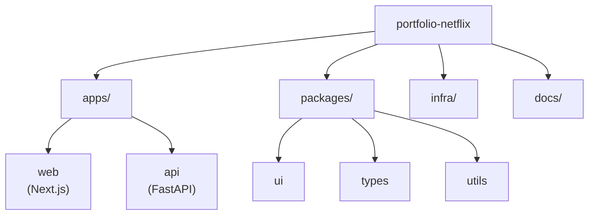
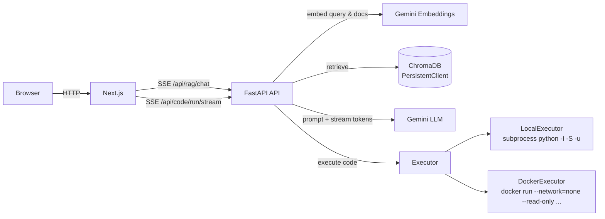

# Architecture & System Design

## Overview

This is a Turbo-powered monorepo with two production-style applications:

- **Web**: `apps/web` (Next.js App Router + TypeScript)
- **API**: `apps/api` (FastAPI) exposing:
  - **RAG** (Retrieval-Augmented Generation) as **SSE**
  - **Python execution** (sync + **SSE**) with **local** and **Docker** executor modes

## Monorepo layout

## Runtime architecture

### RAG architecture diagram

## Key design decisions

- **SSE first**: both RAG and code execution stream over Server-Sent Events for a ChatGPT-like UX.
- **Hard profile isolation for RAG**: Chroma uses **one collection per profile** to avoid cross-profile leakage.
- **Replaceable execution backend**: the code runner selects executors via config (`CODE_EXECUTOR_MODE`) so isolation can evolve without touching routing contracts.
- **Explicit safety model**:
  - Phase-1 AST validator blocks risky imports/calls.
  - Docker executor adds OS-level isolation (read-only FS, no network, resource limits).

## Where to go next

- RAG pipeline + contracts: `RAG.md`
- Code runner safety model + SSE protocol: `CODE_RUNNER.md`
- Frontend structure + IDE/terminal integration: `FRONTEND.md`

