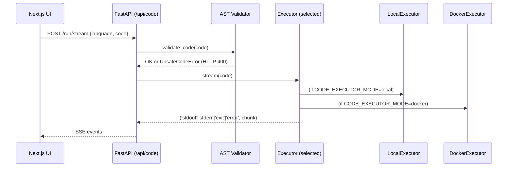

# Python Code Runner (IDE + Terminal)

## Goal

Execute **untrusted Python code** from the browser with:

- a clean **API contract**
- a streaming UX (stdout/stderr as it happens)
- an explicit, auditable safety model

## API surface

```mermaid
flowchart LR
  UI[Next.js Developer IDE] -->|POST /api/code/run| SYNC[Sync response]
  UI -->|POST /api/code/run/stream (SSE)| STREAM[SSE output stream]
```

### `POST /api/code/run` (sync)

- Request: `{"language":"python","code":"..."}`
- Response: `{"stdout": "...", "stderr": "...", "exit_code": 0}`

### `POST /api/code/run/stream` (SSE)

Streams events with **SSE event types**:

- `event: stdout` + `data: <line>`
- `event: stderr` + `data: <line>`
- `event: exit` + `data: {"exit_code": N}`
- `event: error` + `data: <message>`

## Backend design



## Safety model

### Phase 1: AST validation (fast fail)

Implemented in `apps/api/src/modules/code_runner/validator.py`:

- Blocks imports: `os`, `sys`, `subprocess`, `socket`, `pathlib`
- Blocks builtin calls: `eval`, `exec`, `compile`, `open`, `input`
- Rejects syntax errors as unsafe (`HTTP 400`)

### Execution modes

Configured via `CODE_EXECUTOR_MODE`:

- **local** (default): subprocess execution using `python -I -S -u`
- **docker**: `docker run` with explicit isolation flags:
  - `--network=none`
  - `--read-only`
  - `--tmpfs /tmp:rw,noexec,nosuid,size=64m`
  - `--cpus`, `--memory`, `--pids-limit`

## Config

Create `apps/api/.env`:

```bash
CODE_EXECUTOR_MODE=local      # local | docker
CODE_RUNNER_DOCKER_IMAGE=code-runner:latest
CODE_RUNNER_CPUS=1.0
CODE_RUNNER_MEMORY_MB=512
CODE_RUNNER_PIDS_LIMIT=64
```

## Frontend integration

The Developer profile runs code via **SSE** and renders it in a terminal-like UI:

- Hook: `apps/web/src/profiles/developer/hooks/useCodeExecution.ts`
- Terminal component: `apps/web/src/profiles/developer/components/Terminal.tsx`

