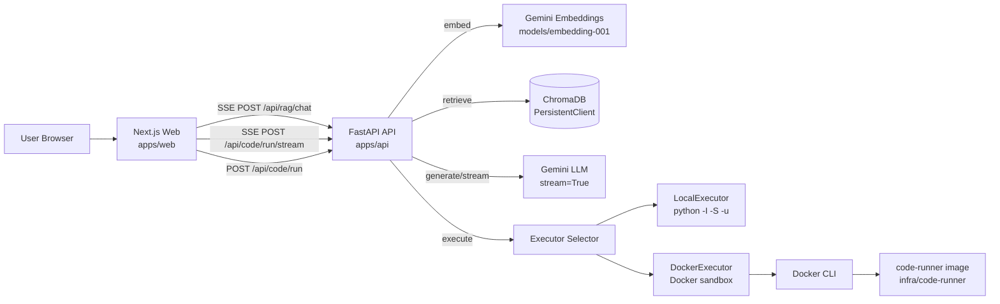
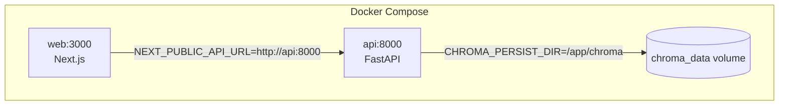
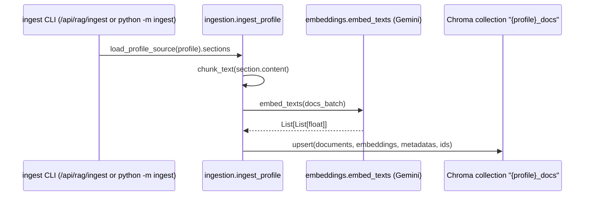
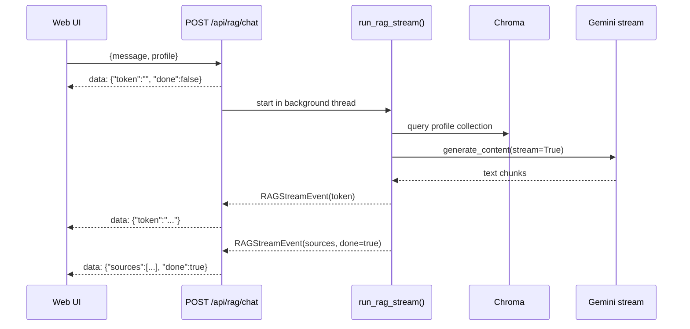
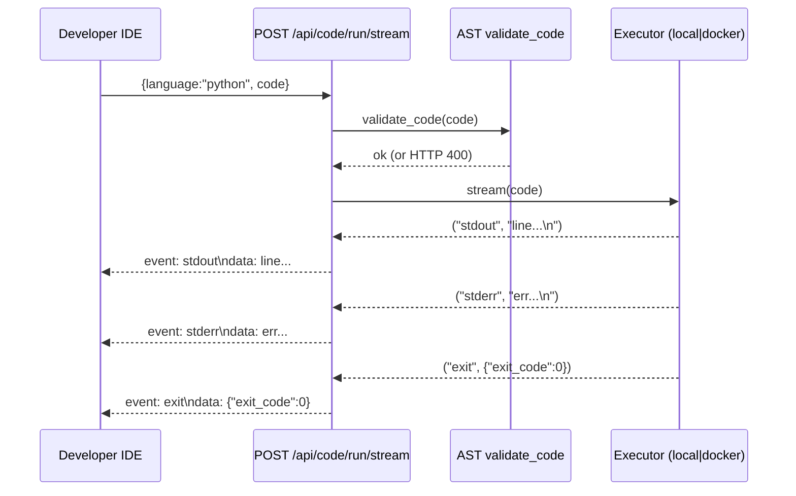

## Portfolio Netflix — Detailed System Design & Documentation

This document is a deep-dive description of the **end-to-end system** in this repository: a **Netflix-inspired, profile-driven portfolio** with a **streaming RAG assistant** and a **browser-based Python IDE + streaming terminal**, backed by a FastAPI service.

It is written from the implementation in:
`apps/api/src/**`, `apps/web/src/**`, `infra/**`, and the existing docs in `docs/**`.

---

## What this repository is (one sentence)

This monorepo builds a **Netflix UI-style portfolio** where users pick a “profile” (Developer/Recruiter/Stalker/Adventurer) and then interact with either **streaming RAG** (chat) or a **secure Python runner** (IDE + terminal), all delivered with a **streaming-first UX** via **Server-Sent Events (SSE)**.

---

## Repository layout (tour)

```text
portfolio-netflix/
├── apps/
│   ├── web/                       # Next.js (App Router) frontend
│   └── api/                       # FastAPI backend (RAG + Code Runner)
├── packages/
│   ├── ui/                        # shared UI components (internal package)
│   ├── types/                     # shared TS types
│   └── utils/                     # shared utilities
├── infra/
│   ├── docker-compose.yml         # local/prod-ish composition (web + api)
│   ├── nginx/nginx.conf           # reverse proxy sketch
│   └── code-runner/               # sandbox image for docker executor
└── docs/                          # system/feature documentation
```

---

## System goals & design principles

- **Profile isolation**
  - The UI is segmented into “profiles” with distinct tone and content.
  - RAG is isolated per profile at the vector-store level (separate Chroma collections) to prevent cross-profile leakage.

- **Streaming-first UX**
  - Both “AI chat” and “code execution” stream partial output to the browser.
  - SSE is used (simple, browser-native, proxy-friendly).

- **Deterministic behavior**
  - RAG chunking is deterministic and budgeting is deterministic (character budget, not tokenizer-dependent).
  - Code execution uses strict timeouts and deterministic Python runtime flags.

- **Explicit security model**
  - Execution safety is designed as a layered model:
    - Phase 1: AST validation blocks risky operations quickly.
    - Phase 2: optional Docker sandbox adds OS-level isolation.

---

## Architecture overview (context)



Key idea: **the frontend streams**, and the backend is responsible for producing a clean streaming protocol.

---

## Runtime composition (Docker Compose + persistence)

`infra/docker-compose.yml` runs:
- `web` (Next.js) on `:3000`
- `api` (FastAPI) on `:8000`

Chroma persistence:
- In Docker, Chroma persists to a **named volume** (`chroma_data`) mounted at `/app/chroma`.
- This avoids common SQLite bind-mount issues on macOS (“disk I/O error”).



---

## Backend (FastAPI) — service boundaries

Entry point: `apps/api/src/main.py`

### Cross-cutting behavior

- **CORS** is enabled via `CORSMiddleware` using `settings.CORS_ORIGINS`.
- **Best-effort `.env` loading** is done to support “run from monorepo root” dev workflows.

### RAG auto-ingest on startup (important behavior)

On FastAPI startup, the API performs **best-effort automatic ingest** if:
- `RAG_AUTO_INGEST` is not disabled (defaults to enabled)
- `GOOGLE_API_KEY` or `GEMINI_API_KEY` exists
- the profile’s Chroma collection is empty

This specifically improves “fresh Docker volume” behavior: the system is usable immediately without a manual ingest step.

---

## RAG deep dive (implementation)

### Data sources (curated knowledge)

Each profile has a JSON file:

```text
apps/api/src/modules/rag/data/
  recruiter.json
  developer.json
  adventurer.json
  stalker.json
```

Each JSON is structured around `sections[]` with:
- `id`: stable section identifier
- `title`: section title (used for citations and UI “sources”)
- `content`: the text that becomes chunked + embedded

### Ingestion (JSON → chunks → embeddings → Chroma)

Ingestion code: `apps/api/src/modules/rag/ingestion.py`

Chunking strategy:
- Split by paragraph boundaries first
- Enforce token windowing using a **whitespace-token approximation**
- Overlap between chunks to preserve continuity

Storage strategy:
- **One Chroma collection per profile**: `"{profile}_docs"`
- Chunk IDs are stable: `"{profile}_{section_id}_{i}"`
- Metadata is stored: `{ profile, section_id, section_title }`



### Embeddings (Gemini)

Embedding wrapper: `apps/api/src/modules/rag/embeddings.py`

- Embedding model: **`models/embedding-001`**
- The wrapper normalizes multiple SDK response shapes into `List[List[float]]`.
- Keys:
  - `GOOGLE_API_KEY` (preferred)
  - `GEMINI_API_KEY` (fallback)

### Retrieval (Chroma query → scored chunks)

Retriever: `apps/api/src/modules/rag/retriever.py`

- Query embedding: `embed_texts([query])[0]`
- Chroma returns `distances` (lower = better)
- Convert to bounded relevance score:
  - \( score = e^{-distance} \)
- Low-signal chunks are filtered:
  - `MIN_RELEVANCE_SCORE = 0.15`
- Results are sorted **best-first** and capped:
  - default `top_k=5`, max `MAX_TOP_K=10`

### Prompting (profile persona + bounded context)

Prompt builder: `apps/api/src/modules/rag/prompts.py`

- System prompt differs by profile (`recruiter|developer|adventurer|stalker`)
- Retrieved chunks are injected into a deterministic context block
  - numbered blocks `[1] Title\ncontent...` to support grounding + later citations
- Context is capped:
  - `MAX_CONTEXT_CHARS = 12_000`

### LLM generation (Gemini) + streaming

- Non-streaming: `apps/api/src/modules/rag/llm.py`
- Streaming: `apps/api/src/modules/rag/llm_stream.py`

Important SDK constraint:
- The implementation “folds” `system` text into the first user turn to keep prompt semantics stable with SDK versions that don’t accept `system_instruction` directly.

### Streaming API: `/api/rag/chat` (SSE framing)

Endpoint: `apps/api/src/modules/rag/router.py`

Contract:
- Response: `text/event-stream`
- Frames are formatted as:
  - `data: {json}\n\n`
- Events are JSON matching `RAGStreamEvent`:
  - `{ "token": "...", "done": false }` (many)
  - `{ "sources": [...], "done": true }` (final)

Operational behavior (important for UX):
- The API emits an immediate “empty token” first event so UIs don’t feel stuck.
- The pipeline is executed in a background thread and streamed through a queue.
- There are explicit deadlines:
  - first-chunk deadline (~20s)
  - total deadline (~45s)
- Proxy-friendly headers:
  - `Cache-Control: no-cache`
  - `Connection: keep-alive`
  - `X-Accel-Buffering: no`



---

## Python IDE + “terminal” code runner deep dive

### Public endpoints

Router: `apps/api/src/modules/code_runner/router.py`

- `POST /api/code/run`
  - request: `{ "language":"python", "code":"..." }`
  - response: `{ "stdout": "...", "stderr": "...", "exit_code": 0 }`

- `POST /api/code/run/stream` (SSE)
  - event types:
    - `stdout`
    - `stderr`
    - `exit` with JSON `{"exit_code": N}`
    - `error` for engine-level failures

Important nuance:
- Unsafe code fails fast with **HTTP 400** (no stream).
- Mid-stream engine failures are surfaced as a single `event: error` (not HTTP 500).

### Phase 1 safety: AST validator

Validator: `apps/api/src/modules/code_runner/validator.py`

Blocks:
- Imports: `os`, `sys`, `subprocess`, `socket`, `pathlib`
- Calls: `eval`, `exec`, `compile`, `open`, `input`
- Syntax errors are treated as unsafe.

This is intentionally explicit and not presented as a complete sandbox.

### Execution modes (local vs docker)

Selection shim: `apps/api/src/modules/code_runner/executor.py`

Configured by:
- `CODE_EXECUTOR_MODE=local|docker`

#### Local executor (subprocess)

`apps/api/src/modules/code_runner/executor_local.py`

- Executes `python -I -S -u` with a temp file.
- Sets `PYTHONHASHSEED=0`.
- Enforces timeout (default 5s).
- Streaming mode reads stdout/stderr concurrently using threads and emits an `exit` event.

#### Docker executor (sandboxed)

`apps/api/src/modules/code_runner/executor_docker.py`

Runs `docker run` with explicit isolation flags:
- `--network=none`
- `--read-only`
- `--tmpfs /tmp:rw,noexec,nosuid,size=64m`
- resource controls: `--cpus`, `--memory`, `--pids-limit`
- mounts the temp script read-only at `/sandbox/code.py`

Sandbox runtime image:
- `infra/code-runner/Dockerfile`
- uses a minimal `python:3.11-slim` base and a non-root `runner` user
- entrypoint: `python -I -S -u`

### Streaming contract (sequence)



---

## Frontend deep dive (Next.js + Netflix-inspired UX)

### Routing + profile isolation

Entry routes:
- `apps/web/src/app/page.tsx`: splash screen → profile selection
- `apps/web/src/app/profile/[profileId]/page.tsx`: dynamic import of a profile module

This has two UX benefits:
- “Netflix” style **profile selection** feels first-class (not a nav bar).
- Profiles can be heavy and still load fast due to **code splitting**.

### Netflix inspiration and UI building blocks

Theme/styling:
- `apps/web/src/styles/netflix-theme.css`
  - Netflix intro animation
  - profile selection screen styling
  - carousel styling, hover previews, etc.
- `apps/web/src/styles/globals.css`
  - global palette variables, background, typography smoothing, “aura glow”

Splash screen:
- `SplashScreen.tsx` plays a Netflix-like intro animation and intro audio.

Profile selection:
- `ProfileSelection.tsx` presents the “Who’s watching?” screen with profile cards.

Carousels + hover previews:
- `ContinueWatchingPreview.tsx` implements:
  - hover-activated video preview cards
  - “pinned” previews (click to keep open)
  - edge hover scroll arrows (optional)
  - custom draggable scrollbar thumb (drag-to-scroll)

### RAG UI (Recruiter profile)

Component:
- `apps/web/src/profiles/recruiter/components/AIFloatingAssistant.tsx`

Key UX decisions:
- Floating “Ask AI” button → opens a chat panel.
- Streaming state is visible via a typing indicator.
- Final event can include “Sources” which become clickable chips, revealing snippets.
- Requests are cancellable via `AbortController`.

Rendering safety:
- `SafeMarkdown.tsx` is a small markdown-ish renderer that:
  - supports lists, emphasis, and linkification
  - enforces “safe href” rules (`http/https/mailto`)
  - avoids raw HTML injection

### Python IDE + terminal UI (Developer profile)

Editor component:
- `apps/web/src/profiles/developer/components/CodeEditor.tsx`
  - Monaco editor (dark theme)
  - expand/collapse behavior
  - “Run” triggers execution and reveals the terminal
  - adds explicit Cmd/Ctrl+A handling so “select all” stays inside Monaco

Terminal UI:
- `Terminal.tsx` renders:
  - “stdout” vs “stderr” lines with styling
  - execution state (“Running…”, “Completed”, “Timed out”, “Failed”)

Streaming implementation detail:
- The frontend uses `fetch()` + `ReadableStream` (`getReader()`), not `EventSource`.
- It parses SSE manually using:
  - `apps/web/src/profiles/developer/utils/parseSSE.ts`

This is important because it works with **POST** requests and request bodies (EventSource is GET-only).

---

## Streaming (SSE) contracts — summary table

### RAG: `/api/rag/chat`

- **Framing**: `data: {json}\n\n`
- **JSON**:
  - `token?: string`
  - `sources?: [{id,title,snippet}]`
  - `done: boolean`

### Code Runner: `/api/code/run/stream`

- **Framing**: `event: <type>\n data: ...\n\n`
- **Types**:
  - `stdout`, `stderr` → data is line text (may be multi-line)
  - `exit` → data is JSON `{"exit_code": N}`
  - `error` → data is a short message

---

## Configuration (most important env vars)

Backend (`apps/api/.env`):

```bash
# Gemini
GOOGLE_API_KEY=...
# or:
GEMINI_API_KEY=...

# Chroma persistence
CHROMA_PERSIST_DIR=./chroma

# Auto-ingestion (1 enabled by default, 0 disables)
RAG_AUTO_INGEST=1

# Code execution mode
CODE_EXECUTOR_MODE=local             # local | docker
CODE_RUNNER_DOCKER_IMAGE=code-runner:latest
CODE_RUNNER_CPUS=1.0
CODE_RUNNER_MEMORY_MB=512
CODE_RUNNER_PIDS_LIMIT=64
```

Frontend (`apps/web/.env.local` or environment):

```bash
NEXT_PUBLIC_API_URL=http://localhost:8000
```

---

## Known limitations / intentional TODOs (as implemented)

- **Auth, rate limiting, and abuse prevention** are placeholders in `apps/api/src/core/security.py`.
- **Profiles API module** (`apps/api/src/modules/profiles/router.py`) is currently stubbed and not the primary data source for UI content.
- **AST validation** is intentionally minimal; the “real” isolation is the Docker executor mode.
- RAG context budgeting is character-based (deterministic) rather than token-based.

---

## Where to read next

- `docs/ARCHITECTURE.md` — high-level diagrams
- `docs/RAG.md` — RAG contract overview
- `docs/CODE_RUNNER.md` — code-runner contract overview
- `docs/FRONTEND.md` — frontend structure overview

