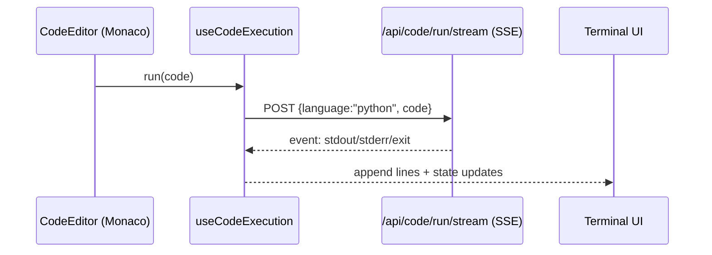

# Frontend (Next.js) — Profiles, IDE, Drag UI

## High-level structure

The web app is built on Next.js App Router with **profile isolation**: each profile is a bounded UI domain under `apps/web/src/profiles/<profile>/`.

```mermaid
flowchart TB
  APP[app/] --> HOME[page.tsx (profile selection)]
  APP --> ROUTE[profile/[profileId]/page.tsx]
  ROUTE --> PROFILES[profiles/*]
  PROFILES --> DEV[developer]
  PROFILES --> REC[recruiter]
  PROFILES --> ADV[adventurer]
  PROFILES --> STK[stalker]
```

## Python IDE + Terminal (Developer profile)

### UX

- Monaco-based code editor
- “Run” triggers backend execution
- Terminal streams output in real time via SSE, distinguishing stdout vs stderr

### Data flow



## RAG Assistant (Recruiter profile)

Recruiter profile includes a floating assistant UI that streams RAG responses over SSE:

- Client: `apps/web/src/services/rag-client.ts`
- UI: `apps/web/src/profiles/recruiter/components/AIFloatingAssistant.tsx`
- Endpoint: `POST /api/rag/chat` (SSE)

## Drag-to-scroll UI (Netflix carousel)

The Netflix carousel includes a **custom draggable scrollbar** (drag-to-scroll) so users can scroll horizontally by dragging the thumb:

- Component: `apps/web/src/components/netflix/ContinueWatchingPreview.tsx`

This is intentionally implemented without external DnD dependencies to keep behavior deterministic and lightweight.

