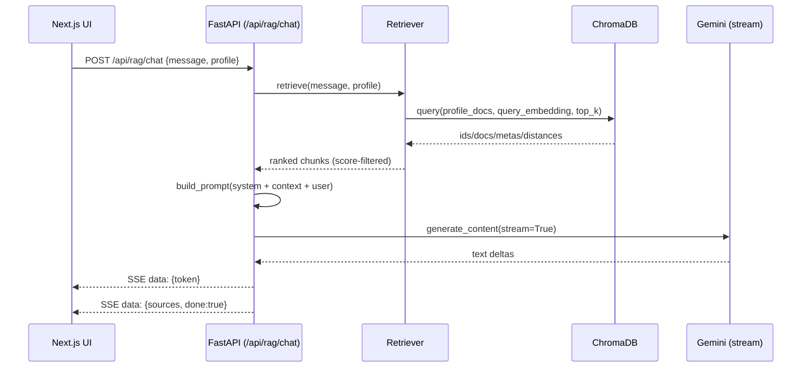

# RAG (Retrieval-Augmented Generation)

## Goal

Provide a **profile-aware**, **grounded**, **streaming** AI assistant that answers from a controlled knowledge base rather than hallucinating.

## Availability (current)

This feature is **currently only exposed in the Recruiter profile UI** (see `apps/web/src/profiles/recruiter/...`).

### Screenshot (Recruiter profile)


## Data model

- Each profile owns a JSON knowledge source in `apps/api/src/modules/rag/data/*.json`
- Content is chunked deterministically and stored in **ChromaDB** with **one collection per profile**

## End-to-end flow



## RAG architecture diagram


## Components (backend)

- **Ingestion**: `src/modules/rag/ingestion.py`
  - `chunk_text()` uses paragraph-first splitting + token-windowing (whitespace token approximation)
  - Writes documents + metadatas + ids into Chroma, embedding via Gemini
- **Embeddings**: `src/modules/rag/embeddings.py`
  - Uses Gemini embeddings (`models/embedding-001`)
  - Normalizes multiple SDK response shapes into `List[List[float]]`
- **Vector store**: `src/modules/rag/vectorstore.py`
  - `PersistentClient` with `CHROMA_PERSIST_DIR` (default `./chroma`)
  - `get_collection(profile)` returns `"{profile}_docs"` (hard isolation)
- **Retrieval**: `src/modules/rag/retriever.py`
  - Converts Chroma distances to a bounded relevance score: \(score = e^{-distance}\)
  - Filters low-signal chunks (`MIN_RELEVANCE_SCORE`)
  - Guarantees best-first ordering
- **Prompting**: `src/modules/rag/prompts.py`
  - Profile-specific system prompts + numbered context blocks
  - Deterministic prompt budget via `MAX_CONTEXT_CHARS`
- **Streaming API**: `src/modules/rag/router.py`
  - `POST /api/rag/chat` returns `text/event-stream`
  - Each SSE `data:` line is JSON of `RAGStreamEvent`

## API contract

### Request

- `POST /api/rag/chat`
- Body: `{"message": string, "profile": "recruiter"|"developer"|"adventurer"|"stalker"}`

### SSE events (`RAGStreamEvent`)

- **Token event** (many times):
  - `{"token": "…", "done": false}`
- **Final event** (once):
  - `{"sources": [{"id","title","snippet"}, ...], "done": true}`

## Local setup

1) Create `apps/api/.env`:

```bash
GOOGLE_API_KEY=...
CHROMA_PERSIST_DIR=./chroma
```

2) Ingest:

```bash
cd apps/api
python -m src.modules.rag.ingest --all --reset
```

